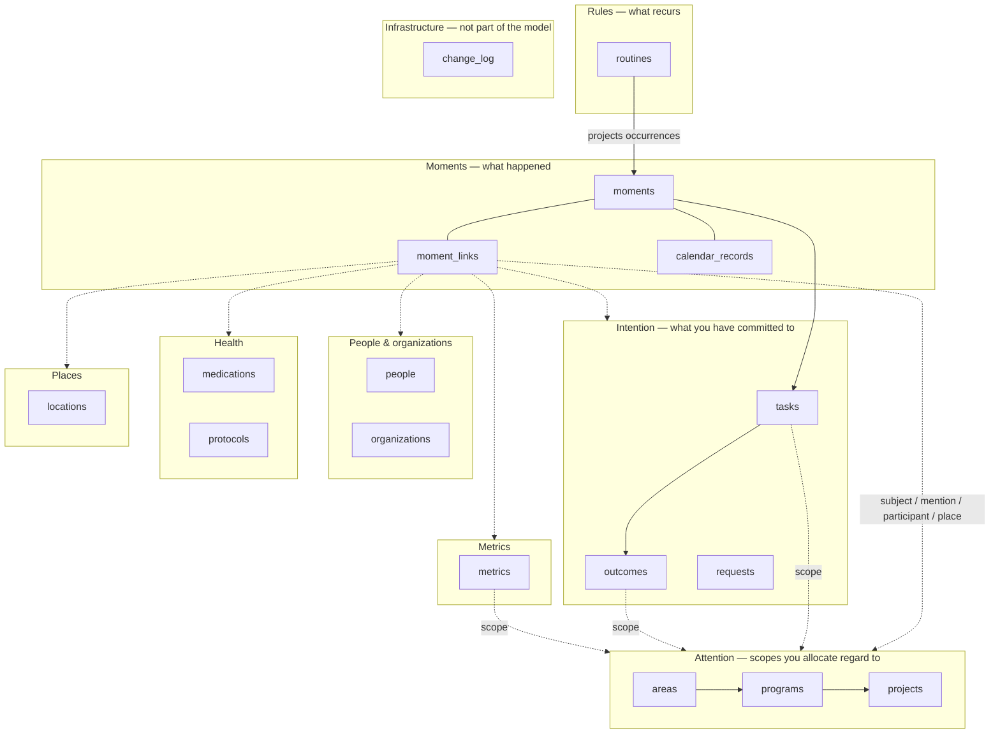
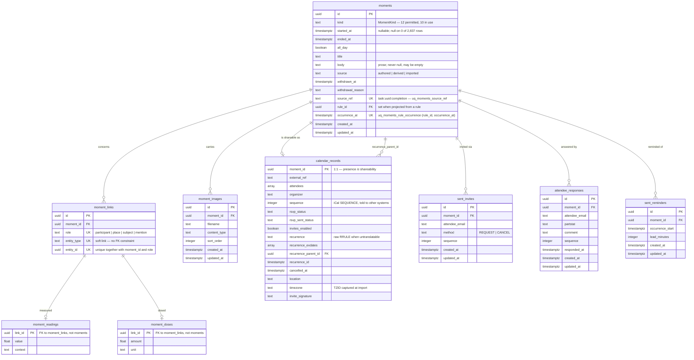
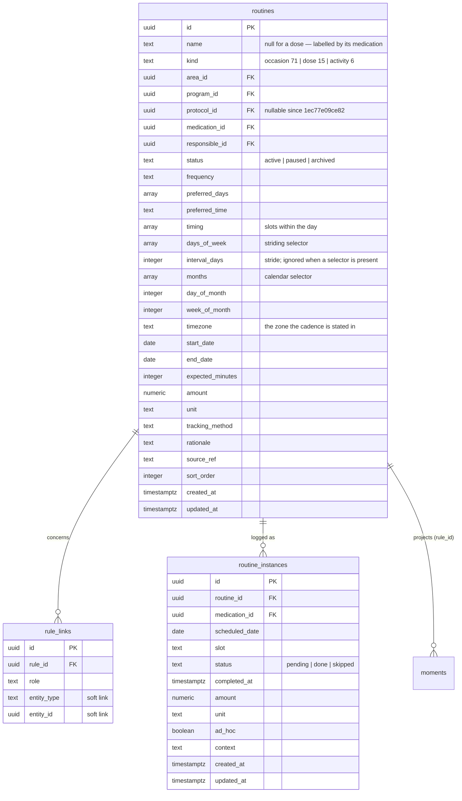
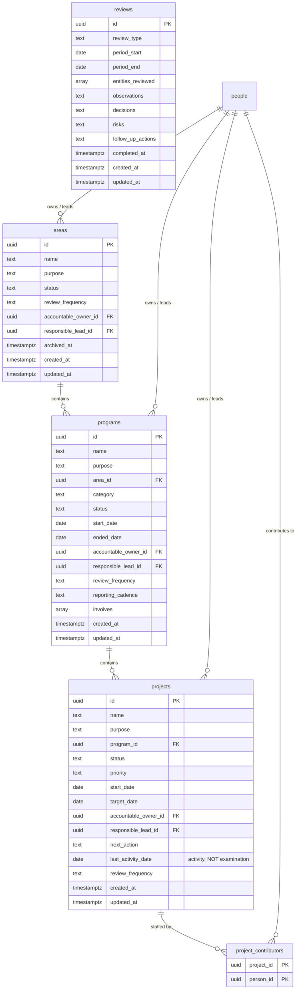
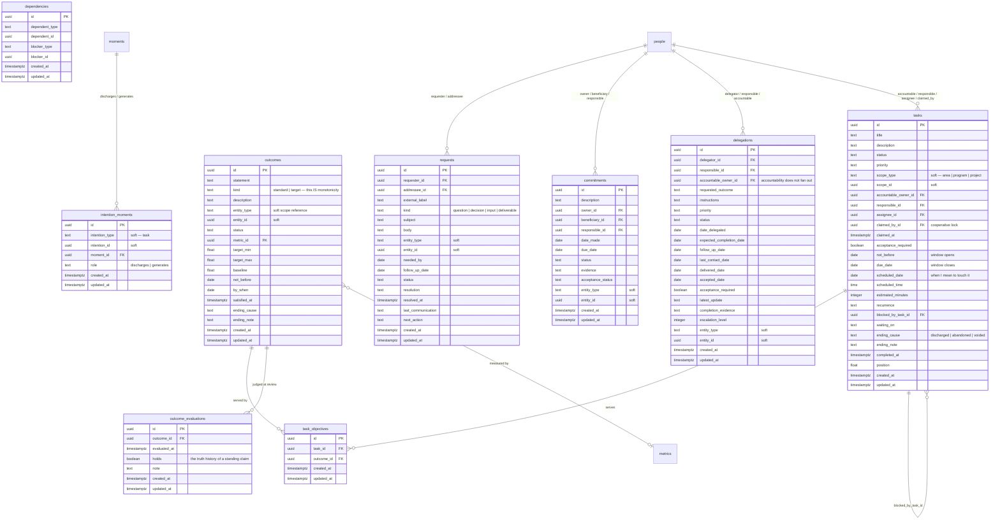
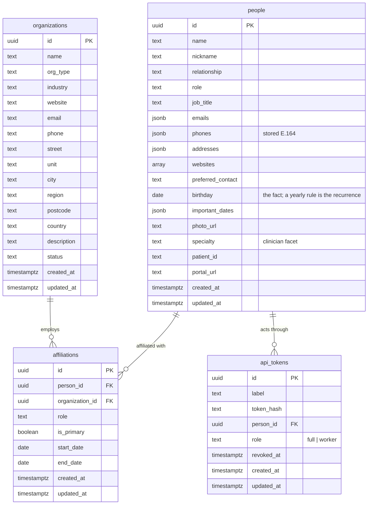
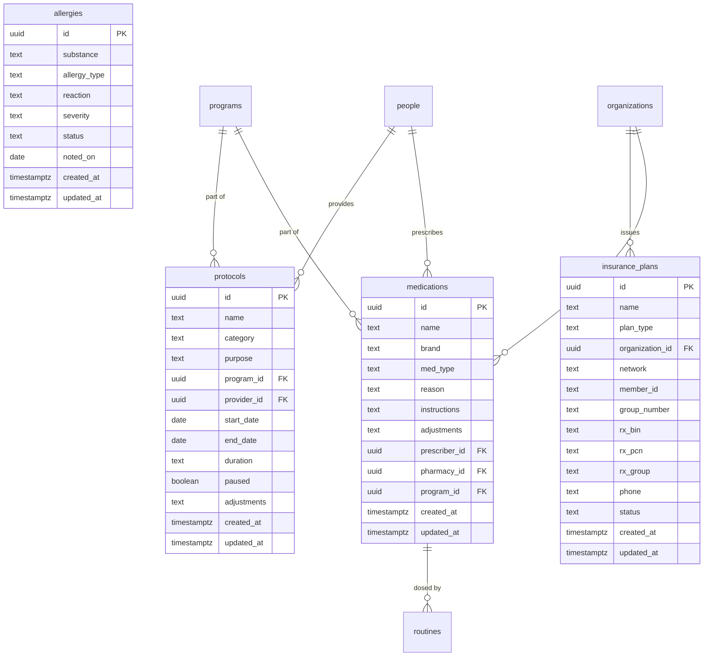
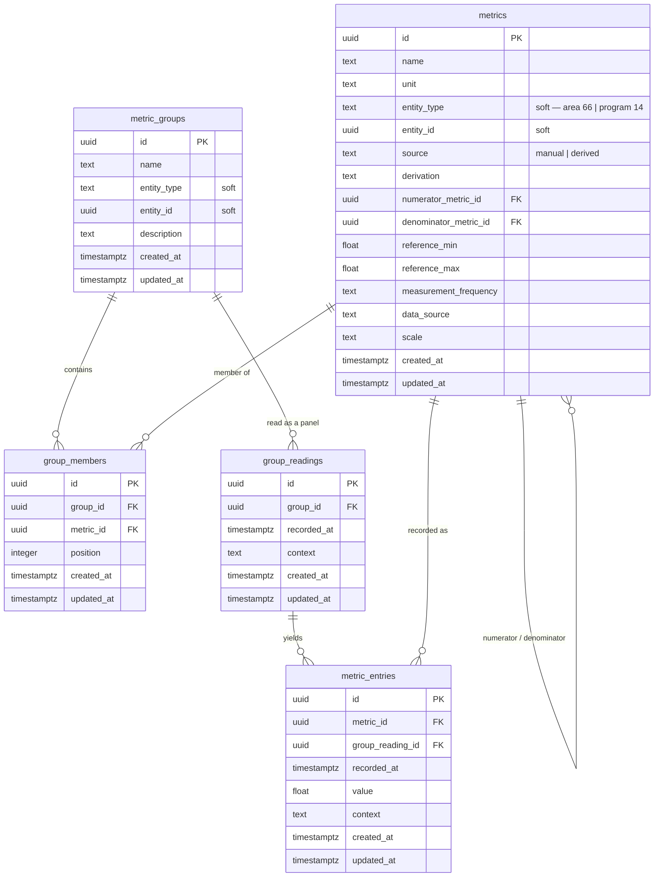
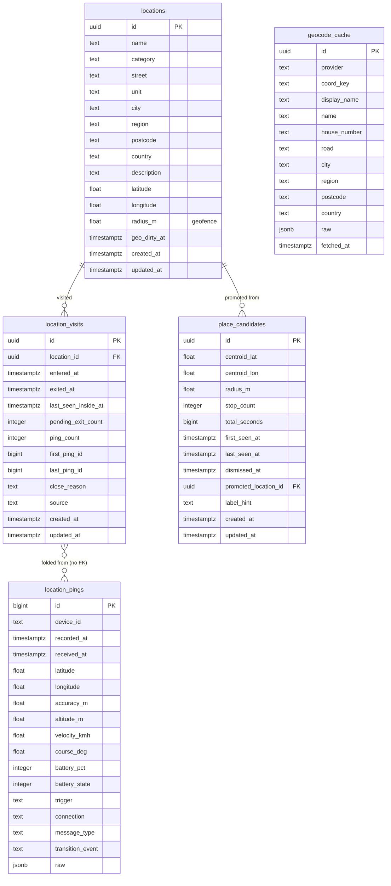
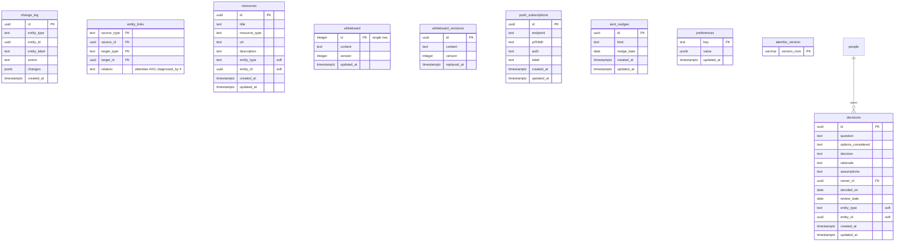

# The schema — an ERD

> **Status: description, not design.** Every table, column and foreign key below
> was read out of the live database on **2026-08-02**, not from the models and
> not from memory. If it disagrees with the code, the code is right and this file
> has rotted — regenerate it rather than patching it (the queries are at the
> bottom).
>
> The three documents in this folder answer different questions:
> `model.md` is **where the model is going** (axioms, phases, an explicit gap
> statement). `moments.md` is **why the moments model is shaped as it is**.
> This one is **what is actually in Postgres** — all 54 tables, nothing elided.

## How to read the diagrams

- **Solid lines** (`||--o{`) are real foreign keys. Every one below exists as a
  constraint in `wild_life`.
- **Dashed lines** (`||..o{`) are **soft polymorphic edges** — an
  `entity_type`/`entity_id` pair with no constraint behind it, because the target
  may be any of two dozen tables. They are drawn only to the types actually
  observed in the data; the permitted sets are tabulated in
  [Soft polymorphic edges](#soft-polymorphic-edges).
- **Row counts** are exact as of 2026-08-02 and appear as `(n)` in the section
  headings. `(0)` is called out wherever it appears, because an empty table is
  either unfinished work or a retirement in progress, and the difference matters.

---

## 0. The map

Nine clusters. `moments` is in the middle because everything dated hangs off it,
and the standing objects around the edge are what moments are *about*.



---

## 1. Moments — what happened (2,837 moments · 2,657 links)

A life is a series of moments; every other object is their *subject* rather than
their owner.

**A moment is what happened.** It carries no window and no intention — those live
on the intention (`tasks.not_before`/`due_date`, `outcomes.by_when`), where the
two ends close on each other as a plan sharpens. `moments.window_start`/
`window_end` did sit here once and all 485 ever written were zero-width, which is
what retired them along with the `work` kind (`c1d2e3f4a5b6`).

The apparent exception is not one. **6 rows have `started_at` in the future, all
`occasion`** — scheduled meetings, the furthest 2026-08-28. A meeting next week is
an occurrence whose time is already settled and has yet to arrive; that is not a
range still closing, which is the thing moments deliberately cannot express.
`started_at` is nullable but **null on none of the 2,837 rows**.

Payload hangs off the **link**, not the moment: a reading belongs to
*this moment concerning that metric*, so one measurement moment can carry a whole
panel. That is why `moment_readings` and `moment_doses` key on `link_id`.



**Kinds in use** (`MomentKind` permits 12):

| kind | rows | | kind | rows |
|---|---:|---|---|---:|
| occasion | 1,316 | | activity | 60 |
| observation | 622 | | dose | 56 |
| completion | 424 | | decision | 8 |
| reflection | 257 | | visit | 7 |
| measurement | 86 | | capture | 1 |
| **exchange** | **0** | | **withdrawal** | **0** |

`work` was removed with its 402 rows (`c1d2e3f4a5b6`) — the window belonged to
the intention, so a shadow moment said the same thing twice. `exchange` and
`withdrawal` have never been written; `exchange` is the delegation half that has
not been built.

**Link roles**: `subject` 1,524 · `mention` 1,008 · `participant` 118 · `place` 7.

---

## 2. Rules — one cadence for everything that recurs (92)

`Routine` is a rule, not a habit. `kind` says what its occurrences *are*, exactly
as `Moment.kind` names an act. Occurrences are **computed, never materialised** —
a projection becomes a row in `moments` only when something happens to it.



`rule_links` holds 17 rows — 15 `subject/medication`, 2 `participant/person`.

---

## 3. Attention — the scopes (8 areas · 24 programs · 37 projects)

Scopes nest, one parent each. A cadence declared at a scope is meant to inherit;
`model.md` records that **inheritance is not implemented**, and that projects are
judged by `last_activity_date`, which is activity rather than examination.



`project_contributors` is **empty (0)**. `reviews` holds 3.

---

## 4. Intention — what has been committed to (470 tasks · 21 outcomes)

Two species today, and `model.md` phase 2 proposes giving them one shape. A task
names its scope by a **single polymorphic reference** (`scope_type`/`scope_id`) —
the three nullable rung FKs are gone, and so is the check constraint that
policed them.



Where the intention cluster actually stands:

| table | rows | reading |
|---|---:|---|
| `tasks` | 470 | live; 460 scoped to a project, 5 to a program, 4 to an area, 1 unscoped |
| `intention_moments` | 423 | **all `discharges`** — the `generates` edge has 0 rows |
| `outcomes` | 21 | 11 on areas, 10 on programs |
| `requests` | 3 | live but barely used |
| `outcome_evaluations` | **0** | the truth history is built and unwritten |
| `task_objectives` | **0** | means-end edges exist as a table only |
| `commitments` | **0** | pre-inversion; folds into `requests` |
| `delegations` | **0** | pre-inversion; folds into `requests` |
| `dependencies` | **0** | superseded by `tasks.blocked_by_task_id` |

Task assignment, by contrast, *is* in use: 447 tasks carry an `assignee_id`.
`claimed_by_id` and `acceptance_required` are 0 — the loop is half-built, not
abandoned.

---

## 5. People & organizations (315 people · 106 orgs)



`api_tokens` holds 3, all `role='worker'` — the agents.

---

## 6. Health (20 medications · 6 protocols)

A medication is an **identity**; protocols own all scheduling, and every schedule
is a rule (§2). There is no PRN flag and no `notes` column — `adjustments`,
`instructions` and `reason` are each named for the question they answer.



`allergies` 1 · `insurance_plans` 3.

---

## 7. Metrics (80 metrics · 325 entries)

A metric names a scope polymorphically, the same way an outcome does. A *group*
is a panel taken together — a lipid panel is one draw with six numbers — which is
why `group_readings` exists between the group and its entries.



**Measurement is stored on both sides, and the moment side is derived.**
`record_moments.py` writes the moment from the metric write, in one transaction:
`record_metric_entry` for a standalone entry (`source_ref=metric_entry:<id>`) and
`record_reading` for a whole panel (`source_ref=group_reading:<id>`), the latter
folding a panel's members into **one** measurement moment carrying many readings.

**It reconciles exactly**, on both counts:

| | |
|---|---:|
| panels · standalone entries | 58 · 28 |
| `measurement` moments (58 + 28) | **86** |
| `metric_entries` | 325 |
| `moment_readings` | **325** |

Nothing enforces that correspondence, though — there is no constraint and no
test. It holds because one writer produces both.

---

## 8. Places (69 locations · 62 pings)

The only cluster with a raw sensor feed. `location_visits` are *derived* — a
visit is a fold over pings — which is the property a rebuild must respect, and
the reason visit moments carry `source='derived'`.



`location_visits` 7 · `place_candidates` 2 · `geocode_cache` 2.

---

## 9. Infrastructure — deliberately outside the model

These are not domain objects. `change_log` is the write-ahead feed that drives
`LISTEN/NOTIFY` → SSE → a global React Query invalidation. The whiteboard is one
buffer, not a collection: `__audit__ = False`, absent from `EntityType` and from
`change_log`, because a scratch space has no subject, no date and no identity.



`change_log` 73,418 · `entity_links` 447 · `resources` 70 · `sent_nudges` 16 ·
`decisions` 8 · `whiteboard` 1 · `push_subscriptions` 2 · `preferences` **0**.

---

## Soft polymorphic edges

Fourteen places where a reference has no constraint behind it, because the target
may be any of the types in `EntityType`. This is the price of one moments table
rather than many, and it is paid knowingly — but it means **referential integrity here is
the application's job, not Postgres's**.

| table | columns | permitted | observed |
|---|---|---|---|
| `moment_links` | `entity_type` / `entity_id` | all of `EntityType` (22) | task 827 · person 787 · metric 325 · project 144 · location 123 · organization 113 · area 108 · program 66 · medication 61 · routine 54 · moment 40 · decision 8 · request 1 |
| `rule_links` | `entity_type` / `entity_id` | all | medication 15 · person 2 |
| `tasks` | `scope_type` / `scope_id` | area, program, project | project 460 · program 5 · area 4 · null 1 |
| `outcomes` | `entity_type` / `entity_id` | any scope | area 11 · program 10 |
| `metrics` | `entity_type` / `entity_id` | any scope | area 66 · program 14 |
| `metric_groups` | `entity_type` / `entity_id` | any scope | — |
| `intention_moments` | `intention_type` / `intention_id` | task, outcome | task 423 |
| `requests` | `entity_type` / `entity_id` | all | — |
| `commitments` | `entity_type` / `entity_id` | all | *(empty table)* |
| `delegations` | `entity_type` / `entity_id` | all | *(empty table)* |
| `dependencies` | `dependent_*` / `blocker_*` | all | *(empty table)* |
| `resources` | `entity_type` / `entity_id` | all | — |
| `decisions` | `entity_type` / `entity_id` | all | — |
| `entity_links` | `source_*` / `target_*` | all | attendee 443 · diagnosed_by 4 |
| `change_log` | `entity_type` / `entity_id` | all + non-entities | — |

`EntityType` deliberately **excludes `event`, `note` and `protocol_item`**: each
names a table that no longer exists, and a type that can be named but not
constructed is a constructor for something that cannot exist. `protocol_item`
outlived its table until this survey found it, having pointed at nothing in any
column above — which is exactly what kept it invisible.

---

## What the ERD makes visible

Two things are easier to see here than in the code, stated as observations
rather than proposals.

**1. The empty tables split into two kinds.** `commitments`, `delegations` and
`dependencies` are *pre-inversion* — superseded, awaiting retirement.
`outcome_evaluations`, `task_objectives`, `project_contributors` and
`preferences` are the opposite: structure built ahead of the surfaces that
would write to it. Reading either group as "unused, therefore droppable" would be
a mistake in one of the two directions.

**2. Attention has no representation.** Every moment has a duration
(`started_at`→`ended_at`) and nothing records whose attention it consumed, because
`moments` was built by inverting nine tables that were all one person's. It
has no actor column. As long as only one person writes moments this is a saving;
the first agent that writes one makes it a defect.

---

## Regenerating this

```bash
export PGPASSWORD="$(wildpc secret get POSTGRES_PASSWORD)"
PSQL="psql -h localhost -U castle -d castle -At -F|"

# tables + exact row counts
$PSQL -c "SELECT relname FROM pg_class c JOIN pg_namespace n ON n.oid=c.relnamespace
          WHERE n.nspname='wild_life' AND relkind='r' ORDER BY 1;"

# every column, in order, with nullability
$PSQL -c "SELECT table_name, ordinal_position, column_name, data_type, is_nullable
          FROM information_schema.columns WHERE table_schema='wild_life'
          ORDER BY table_name, ordinal_position;"

# every foreign key
$PSQL -c "SELECT src.relname||'|'||ka.attname||'|'||tgt.relname
          FROM pg_constraint con
          JOIN pg_class src ON src.oid=con.conrelid
          JOIN pg_class tgt ON tgt.oid=con.confrelid
          JOIN pg_namespace n ON n.oid=src.relnamespace
          JOIN pg_attribute ka ON ka.attrelid=src.oid AND ka.attnum=con.conkey[1]
          WHERE con.contype='f' AND n.nspname='wild_life' ORDER BY 1;"
```
